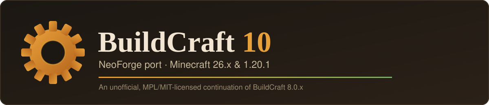

<p align="center">
  
</p>

<p align="center">
  <a href="LICENSE-NEW"></a>
  <a href="LICENSE.PORT"></a>
  
  
  
</p>

**BuildCraft 10** is an unofficial, from-scratch port of **BuildCraft 8.0.x** — originally built for
Minecraft 1.12.2 on Forge — to **NeoForge**, targeting two versions of the game at once:

| Target | Minecraft | Notes |
| --- | --- | --- |
| `neoforge-26x` | 26.1 / 26.2 / 26.3 | Primary target, modern NeoForge API |
| `neoforge-1201` | 1.20.1 | Compatibility target, on NeoForge's Forge-compatible fork |

This is not a simple recompile. Ten years of Minecraft API changes sit between 1.12.2 and either
target, so every system — capabilities, networking, rendering, world generation, NBT — has been
rebuilt against whatever each platform actually offers today, verified against the real jars rather
than assumed. **[PORTING.md](PORTING.md)** is the living, evidence-heavy record of that work: every
real API divergence found, every bug fixed along the way, and the build/verification history for
every feature landed so far.

## Status

This is a **pre-release, in-development port.** Large parts of the original mod work today; large
parts don't exist yet. Current version: **`10.0.0-alpha`**.

| Module | What it covers | Status |
| --- | --- | --- |
| `factory` | Chute, Mining Well, Pump, Tank, Flood Gate, Auto Workbench, Distiller, Heat Exchanger | **Done** |
| `energy` | Stirling, Combustion, and RF engines; oil/fuel fluids; fuel/coolant registry; basic oil world-gen | Mostly done — the original's multi-shape oil lake/spout generator and its custom biomes remain |
| `transport` | All 9 item/fluid/power-pipe material families (including diamond, obsidian, lapis, daizuli, emzuli, stripes), a real wire network, gates, and pluggables | Mostly done — facades, gate accessories (lens/pulsar/timer/light sensor), and pipe/wire dye colouring remain |
| `builders` | Quarry (working core machine + renderer), Filler (most patterns), Builder, Architect Table, a real (simplified) blueprint system | Mostly done — blueprint rotation/tile-entity capture and a handful of Filler patterns remain |
| `silicon` | Assembly, Advanced Crafting, Integration, and Charging tables; marker/laser rendering | In progress — the laser emitter that actually powers the tables is the current focus |
| `robotics` | Zone Planner (this module turned out to be just the claim-map tool, not a full robot system) | Mostly done — the 3D map viewport remains |

This project also now does something the original team's own now-superseded reference tree
couldn't: every rendering-correctness bug — engines/pipes/tanks/tables colliding as a full cube
regardless of their real shape, missing item icons, a tank texture whose transparency this port's
own pipeline mishandled — gets found via a real client session and fixed with real geometry, not
left as a visual footnote. See the "Remaining" table near the bottom of [PORTING.md](PORTING.md) for
the authoritative, continuously updated breakdown.

## Roadmap

1. **Port everything** — every original BuildCraft 8.0.x feature working on both targets, verified
   against real gameplay, not just compiling.
2. **`v1.0`** — feature-complete port. Both targets stable, both verified by real play, not just
   automated checks.
3. **Beyond `v1.0`** — new content, quality-of-life and balance changes, and a pass on the mod's
   visual identity (updated models/textures) that the original team never got to on this API
   generation.

Nothing here is a promised date — this is a part-time project. It's a direction, not a deadline.

## Building from source

Requires **Java 25** for the `neoforge-26x` target (Gradle will provision a matching toolchain if
you don't have one — don't use Gradle 8.x, it can't drive a Java 25 toolchain, and the wrapper here
is already 9.x).

```bash
git clone https://github.com/SirStig/BuildCraft.git
cd BuildCraft
./gradlew build                      # builds every target
./gradlew :neoforge-26x:build        # Minecraft 26.3 (default; -Pbc.mc26=26.1 or 26.2 for others)
./gradlew :neoforge-1201:build       # Minecraft 1.20.1
./gradlew :neoforge-26x:runClient    # launch the game with the mod loaded
```

Windows: use `gradlew.bat` in place of `./gradlew`. Built jars land in
`platforms/<target>/build/libs/`.

## Contributing

Issues and pull requests are welcome. Before opening a PR for anything beyond a small fix, please
open an issue first to talk through the approach — this project verifies every API claim against
the real jars rather than assuming symmetry between the two targets, and a lot of context lives in
[PORTING.md](PORTING.md) that's worth reading first.

## Licensing

BuildCraft is under two licenses, and this port keeps both — neither permits relicensing code you
didn't write, so a ported file stays under whatever license it already had, with this port's
copyright added alongside the original notice.

| Code | License | File |
| --- | --- | --- |
| `buildcraft.api.*` | MIT | `LICENSE.API` (in the `BuildCraftAPI` submodule) |
| Everything else ported from BuildCraft 8.0.x | MPL 2.0 | `LICENSE-NEW` |
| Files written for this port, not derived from earlier BuildCraft code | MIT | `LICENSE.PORT` |

Every source file states which of the three applies to it.

## Credits

BuildCraft was originally created by SpaceToad and the BuildCraft team. This port is not affiliated
with, endorsed by, or maintained by the original BuildCraft project — it's an independent,
permissively-licensed continuation built on the code they released under MPL 2.0 / MIT. Original
copyright notices are preserved in every file that carries them.

Minecraft is a trademark of Mojang Studios / Microsoft. This project is not affiliated with or
endorsed by Mojang or Microsoft.
